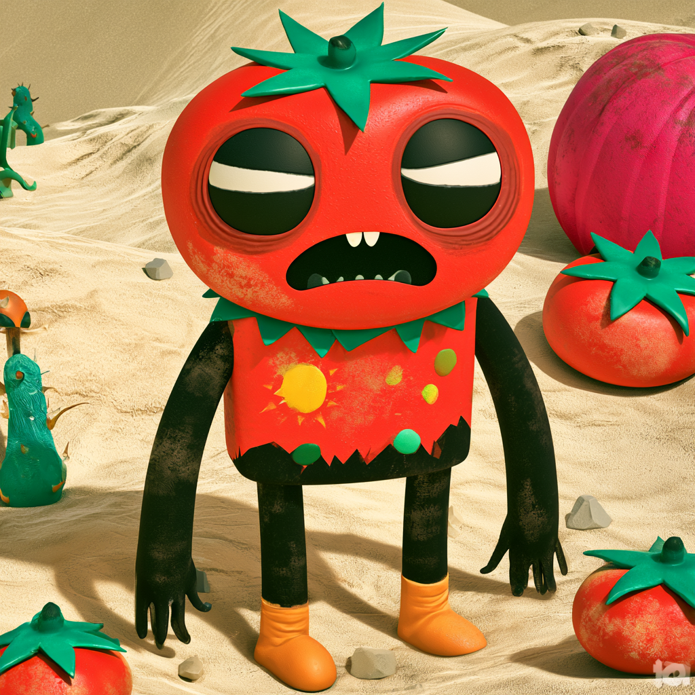

# 🍅 TOMATO MAN

> The sun is death. Shade is the only ground you can stand on — and it **moves** as the sun sweeps the sky. Sweep through the shadows, gather the aloe, beat the heat, and don't get burned.

A single-file, mobile-first, top-down action-platformer. Hero: **Tomato Man** (named by Penny, who kept calling her sunburnt dad "tomato man"). No build step, no dependencies — just open the HTML file.

## ▶️ Play

**Live:** **https://stephenuffugus.github.io/Tomato_Man/** *(once GitHub Pages is on — repo Settings → Pages → Deploy from branch → `main` / root)*

Or open **[`index.html`](index.html)** locally in any modern browser (works great on a phone — add it to your home screen).

- **Move** — left thumb (floating joystick) or WASD / arrows
- **DASH** — cross a thin sun sliver (but it burns you *fast* in the open). Space.
- **SHADE** — drop a temporary safe circle. Q.
- **SPF** — a few seconds of immunity. E.
- **ICE** — briefly slow the sun's sweep to reposition (worlds 3+). F.
- **Pause** — Esc.

Collect **🌿 Aloe** — but only while standing **in the sun** (risk = reward). Chain pickups without burning to build a **Fresh Streak** multiplier.

## 🎮 What's in it

- **5 worlds × 4 hand-built levels (20 total)** + an endless **Shadow Run** + a **Daily Challenge** (same seed for everyone each day, with streaks).
  1. **Morning Tide** — long forgiving shadows; learn the sweep, the dash, dropping shade, riding clouds.
  2. **Midday Blaze** — short shadows, hot sand, patrolling cart-shadows, popsicles, SPF economy.
  3. **Tide Pools** — wilting awnings (no camping) + ice water (slow the sun).
  4. **Dunes at Dusk** — wind drift that pushes you and re-tilts umbrellas; wide raking sun.
  5. **Eclipse** — the **Angry Sun** boss (telegraphed lunges) + eclipse darkness windows.
- **Aloe economy + shop** — 8 tiered upgrades (the T3 power tiers gate behind Gold medals so you can't grind past skill), single-use boosts, and **24 cosmetics**.
- **Character builder** — "build your tomato man": swap produce (tomato → strawberry → avocado → golden…), hats, and dash trails.
- **Game feel** — momentum movement, a hop/dash with squash-&-stretch + hitstop, coyote-grace on shade edges so instant-death stays *fair*, screen shake, particles, combo juice.
- **Procedural Web Audio** — SFX + a distinct per-world music bed, no asset files.
- Stars, medals, best times, full **localStorage** save, settings (SFX / music / reduce-motion).

## 🎨 Art (optional, drop-in)

The game renders **everything procedurally**, so art is 100% optional and risk-free. To use your own:

1. Make an `art/` folder next to `index.html`.
2. Save a PNG at the path the loader expects (see `ASSET_PATHS` in the file).
3. Reload — if the file loads it's used, otherwise it silently falls back to procedural art.

The full asset list, style guide, and ready-to-paste Midjourney / ChatGPT / Gemini prompts are in **[`ART-NEEDED.md`](ART-NEEDED.md)** (also mirrored in the Google Drive "Tomato Man" folder).

## 🛠️ For developers

Everything lives in `index.html`. Key sections (search the `<script>`):

- `LEVELS` — the 20 levels as plain data (world px, y-down, travel bottom→top). Easy to tune on a phone.
- `genLevel()` — the procedural generator for endless/daily.
- `computeShade()` / `safeAt()` — the swept-shadow geometry & safety test.
- `update()` — the sim (movement, mechanics, exposure, pickups, win/burn).
- `BASE_FEEL` / `FEEL()` — movement & burn tuning (+ upgrade modifiers).
- `ECON` / `UPGRADES` / `CONSUMABLES` / `COSMETICS` — the economy.
- `SFX` / `MUSIC` — the procedural audio.

**Older prototypes** (`umbra-v4.html`, `UMBRA-HANDOFF.md`) are kept for reference — `index.html` (the Tomato Man build) supersedes them.

---

*Made with ☀️ for Penny.*
